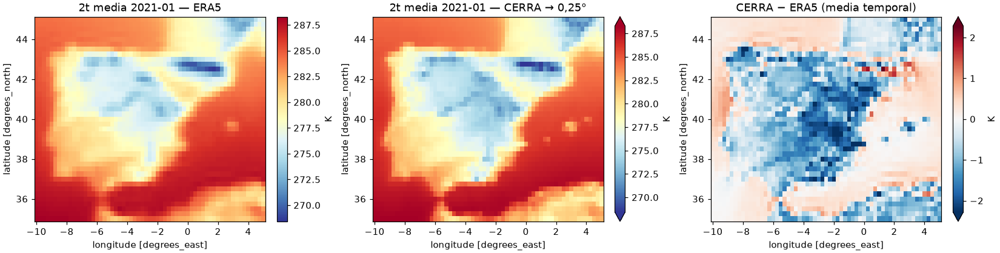

# era5-anemoi-iberia

[](https://github.com/gllobet11/era5-anemoi-iberia/actions/workflows/ci.yml)

Reproducible pipeline that downloads a regional ERA5 subset (Iberian Peninsula, 2020–2022, 6-hourly)
from the Copernicus CDS, converts GRIB to Zarr with Xarray/CDO, runs quality checks, and builds an
[anemoi-datasets](https://anemoi.readthedocs.io/projects/datasets/) dataset from the same raw GRIB.

**Why.** Data-driven weather models (e.g. AIFS) train on regional or global reanalysis stored as
chunked Zarr. This repo is the data-engineering side of that: getting ERA5 from GRIB/NetCDF to an
analysis-ready, checked, training-ready dataset, reproducibly. **It does not train or evaluate any model.**

```
CDS API ──ingest──▶ data/raw/*.grib + manifest.json (sha256)
                        │
          ┌─────────────┴──────────────┐
      transform (Xarray)          anemoi-datasets create
          │                       (recipes/iberia.yaml)
   data/zarr/iberia.zarr          data/zarr/iberia-anemoi.zarr
          │                              │
         qc ──▶ reports/qc_*.{json,md}   └─▶ compared with the own Zarr
```

| Item | Value |
|---|---|
| Domain | N 45, W −10, S 35, E 5 (0.25°, 41 × 61 points) |
| Period / step | 2020-01 → 2022-12, 6 h (4384 timesteps) |
| Variables | `2t`, `10u`, `10v`, `msl`, `tp`, `sp`; `t`, `z` at 500 and 850 hPa |
| Raw format | GRIB (canonical); one month also as NetCDF for comparison |
| Tools | Python 3.11, Xarray/cfgrib, CDO, NCO, Zarr v2, anemoi-datasets 0.5.44 |

## Quick start

```bash
micromamba env create -f environment.yml && micromamba activate era5
python -m era5_pipeline.cli ingest    --config configs/iberia.yaml   # needs ~/.cdsapirc
python -m era5_pipeline.cli transform --config configs/iberia.yaml
python -m era5_pipeline.cli qc        --zarr data/zarr/iberia.zarr  # exit 1 if a check fails
anemoi-datasets create  recipes/iberia.yaml data/zarr/iberia-anemoi.zarr
anemoi-datasets inspect data/zarr/iberia-anemoi.zarr
pytest -q && ruff check .
```

Docker (same `environment.yml`): `docker build -t era5-pipeline . && docker run --rm era5-pipeline pytest -q`

## anemoi-datasets

`recipes/iberia.yaml` builds the dataset straight from the raw CDS GRIB files (`grib` source joined
with an `accumulate` block for 6 h `tp`). anemoi-datasets 0.5.44's `grib` source ignores the hourly
intervals that `accumulate` asks for, so the repo registers a 10-line subclass,
`grib-hourly-accum` (`src/era5_pipeline/anemoi_sources.py`), via an entry point. The dataset starts
at 2020-01-01 06 UTC because the 00 UTC `tp` window needs December 2019, which isn't downloaded.

Result (`reports/anemoi_inspect.txt`): 4383 × 10 × 1 × 2501, 6 h, 0 missing dates, 231 MiB, built in
7 min 40 s. Compared with the Xarray Zarr on the same dates and points (`reports/anemoi_vs_zarr.md`):

| Variable | Mean (own Zarr) | Mean (anemoi) | Std (own) | Std (anemoi) | Max abs diff |
|---|---|---|---|---|---|
| 2t (K) | 289.352 | 289.352 | 6.9759 | 6.9759 | 0 |
| 10u (m s-1) | 0.412871 | 0.412871 | 3.76856 | 3.76856 | 0 |
| 10v (m s-1) | -0.463418 | -0.463418 | 3.3119 | 3.3119 | 0 |
| msl (Pa) | 101800 | 101800 | 626.882 | 626.882 | 0 |
| sp (Pa) | 97920.2 | 97920.2 | 4484.91 | 4484.91 | 0 |
| tp (m, 6 h) | 4.37488e-04 | 4.37493e-04 | 1.5785e-03 | 1.5785e-03 | 9.5e-07 |
| t_500 (K) | 257.84 | 257.84 | 5.25238 | 5.25238 | 0 |
| t_850 (K) | 283.852 | 283.852 | 6.94203 | 6.94203 | 0 |
| z_500 (m2 s-2) | 56288.1 | 56288.1 | 1206.7 | 1206.7 | 0 |
| z_850 (m2 s-2) | 14914 | 14914 | 524.832 | 524.832 | 0 |

Every field is identical except `tp`. `accumulate` writes its sums to a temporary GRIB packed at
16 bits, so 1 % of `tp` values move by less than one quantisation step (field range / 2^16). The
statistics that `inspect` prints differ from the table because anemoi computes them on its own
period only (2020-01-01 06 → 2022-05-26 12), not on the full dataset.

`notebooks/01_open_anemoi.ipynb` opens the dataset with `anemoi.datasets.open_dataset`, subsets by
date and variable and plots `2t`.

## CI

`lint` (ruff) · `test` (pytest, coverage ≥ 80 % on `transform`/`qc`) · `e2e` (mocked ingest →
transform → QC, and the anemoi recipe, on small GRIB fixtures) · `docker` (build image, run tests inside).
CI never contacts the CDS and uses no secrets: all tests run on versioned fixtures (< 1 MB).

## Running on a Slurm cluster (simulated locally)

> This is **not** a real HPC run. It uses [slurm-docker-cluster](https://github.com/giovtorres/slurm-docker-cluster)
> (Slurm 26.05 in Docker): one login/controller container and two compute containers that share the
> same laptop CPUs and RAM. It exercises the Slurm workflow (job arrays, dependencies, per-task logs),
> not performance or scale.

`slurm/submit.sh` chains three jobs:

1. `ingest_array.sbatch`: one array task per month (`--array=0-35%4`). The task maps
   `SLURM_ARRAY_TASK_ID` to a month with `cli months`, so the period only lives in `configs/`. It then
   runs `ingest --month YYYY-MM`. The manifest is updated under `flock`, so concurrent tasks don't
   drop each other's entries.
2. `transform.sbatch` (`--dependency=afterok:<array>`): one job that rebuilds the whole Zarr (Decisions D-011, D-015).
3. `qc.sbatch` (`afterok:<transform>`): the job fails if any critical check fails.

The cluster mimics a typical HPC layout, so the batch scripts carry no host-specific paths:

| Path in the cluster | Role |
|---|---|
| `/gpfs/projects/era5-anemoi-iberia` | shared project filesystem: repo + `data/` (bind mount of the host repo) |
| `/gpfs/apps/envs/era5` | shared software: the micromamba env built from `environment.yml` inside the cluster |
| `module load era5` | Lmod modulefile (`/opt/modulefiles/era5/1.0.lua`) that puts the env on `PATH` |
| `/home/era5/.cdsapirc` | the user's CDS credentials |

The `.sbatch` files only run `module load era5`. On a real cluster that line becomes the site's
module or environment, and the rest stays the same. Each job requests `--mem`, and memory is
accounted with `jobacct_gather/linux`, so `sacct`/`sstat` report `MaxRSS`.

```bash
# once: build the cluster image (needs BuildKit, i.e. the docker buildx plugin)
git clone https://github.com/giovtorres/slurm-docker-cluster ../slurm-docker-cluster
cd ../slurm-docker-cluster && docker compose build slurmdbd

export ERA5_REPO=$OLDPWD              # the only host-specific path
docker compose -f docker-compose.yml -f $ERA5_REPO/slurm/compose.override.yml up -d slurmctld cpu-worker
$ERA5_REPO/slurm/cluster_setup.sh     # user with host UID, memory accounting, env + module (idempotent)

docker exec -u era5 -w /gpfs/projects/era5-anemoi-iberia slurmctld slurm/submit.sh
docker exec slurmctld squeue          # logs: slurm/logs/{ingest_%A_%a,transform_%j,qc_%j}.out
docker exec slurmctld sacct -o JobID,JobName,State,NodeList,Elapsed,MaxRSS
```

Result of the run on 2026-09-27:

- Ingest: 36/36 array tasks completed on c1/c2, 4 at a time, 3-5 s each. All months were already
  downloaded, so the tasks verified their checksums and skipped. In an earlier run,
  `pressure_2022-12.grib` was removed on purpose and its task re-downloaded it from the CDS with a
  byte-identical sha256.
- Transform: completed in 11 min, with `MaxRSS` 5.1 GiB (vs 5.2 GB measured locally). The runtime
  varies between runs, from 6 to 11 min, because the "nodes" share the laptop with everything else.
- QC: passed.

Memory is sampled, not enforced. `jobacct_gather/linux` reads the RSS of the job's processes from
`/proc` every few seconds (`--acctg-freq=task=2` for transform), so a spike shorter than the interval
is missed. With the cluster default of 30 s the reported peak was 3.7 GiB. `--mem` only drives
scheduling here: without cgroups, nothing kills a job that exceeds it. A real HPC would use
`task/cgroup` + `jobacct_gather/cgroup` for exact accounting and enforcement.

## CERRA vs ERA5 (one month)

[CERRA](https://cds.climate.copernicus.eu/datasets/reanalysis-cerra-single-levels) is the C3S
European regional reanalysis at 5.5 km. It uses a Lambert conformal grid (1069×1069 points, standard
parallel 50°N, central meridian 8°E): `x`/`y` are metres on the projected plane and latitude/longitude
are 2D fields, so it cannot be sliced by lat/lon like ERA5. The CDS does not crop CERRA, so every
request returns the full European domain.

`scripts/cerra.py all` downloads January 2021 (`2t`, `msl`, 6-hourly analyses, 541 MB). It then
regrids it with `cdo remapcon` onto the project's 0.25° ERA5 grid, writes
`data/zarr/cerra_iberia.zarr` and compares it with ERA5 (Decisions D-016). Conservative remapping is
used because going from 5.5 to 25 km means aggregating ~20 CERRA points per ERA5 cell. Bilinear
remapping samples only 4 of them, and raises the 2t RMSE against ERA5 from 1.39 to 1.54 K.

| CERRA − ERA5, 2021-01 | mean bias | RMSE | spatial corr. (monthly mean) |
|---|---|---|---|
| 2t | −0.39 K | 1.38 K | 0.991 |
| msl | −14 Pa | 58 Pa | 0.993 |



CERRA is 1-2 K colder over the interior of the peninsula. This month includes storm Filomena; the
link to better-resolved cold pools and snow cover at 5.5 km is a hypothesis, not something tested
here. This is a one-month side study: the CERRA Zarr is not part of the QC, CI or anemoi dataset.

## Key design decisions

Full log with discarded alternatives in `Decisions.md` (Spanish).

- **GRIB is the canonical raw format** (D-002). One month is also fetched as NetCDF: values are
  identical, only names (`valid_time` vs `time`) and attributes differ (`reports/grib_vs_netcdf_*.md`).
- **`tp` is summed, not subsampled** (D-010). It is accumulated, so the 6 h value at T is the sum over (T−6 h, T].
  A test checks that the 6 h sum equals the hourly sum, and incomplete windows become NaN.
- **Idempotent ingest** (D-009): one request per month and type, manifest with sha256, `.part` + atomic rename,
  retries with backoff. Re-running downloads nothing new.
- **Zarr is rewritten atomically** (D-011) instead of appended, so a failed run never leaves a half-written store.
- **Two outputs from the same raw files** (D-005): the own Zarr and the anemoi dataset, compared numerically.
- **zarr v2 pinned** (D-007) because anemoi-datasets 0.5.44 needs it.
- **Tests and CI never touch the CDS** (D-004).

CDO is used for one step, `remapbil`/`timselsum`, compared against the Xarray equivalent
(`reports/cdo_vs_xarray.md`): differences are ≤ 1.5e-5 K for `t2m` and 0 for the `tp` sum. CDO labels the
6 h windows with their centre time and Xarray with the end time; the pipeline uses the latter.

## Quality control

`cli qc` runs 5 critical checks (missing/duplicated timesteps, monotonic coordinates, units, NaN %,
physical ranges) with thresholds in `configs/iberia.yaml`, and writes JSON + Markdown reports
(`reports/qc_2026-09-27.md`). On the full 2020–2022 Zarr all checks pass: 4384/4384 timesteps, 0 % NaN,
no value outside its physical range. `tests/test_qc.py` injects one fault per check and asserts that each is detected.

## Limitations

- **Simulated Slurm, not HPC.** See the Slurm section: two containers on one laptop; no performance claims.
- **anemoi dataset starts at 2020-01-01 06 UTC** (the first `tp` window needs December 2019, not downloaded),
  and needs a 10-line custom `grib` source plugin for hourly accumulations (D-014). `tp` differs from the own Zarr by
  less than one 16-bit quantisation step.
- **Transform needs ~5 GB of RAM** (builds the whole dataset before writing); the anemoi build peaks at ~1 GB.
- **CERRA is a one-month, two-variable side study**, not part of the QC, CI or anemoi dataset.
- **QC checks plausibility, not correctness**: it cannot tell whether ERA5 itself is right.
- Single domain and period, hard-coded in `configs/`. No model is trained, so nothing here shows the
  dataset is good for training beyond the checks above.
- The CDS download itself is tested by hand only; CI uses small fixtures.

## Next steps

Extend the anemoi recipe to more levels/variables; add `task/cgroup` accounting and a real HPC run;
build the CERRA dataset with the same QC; train a small baseline model to validate the dataset end to end.
